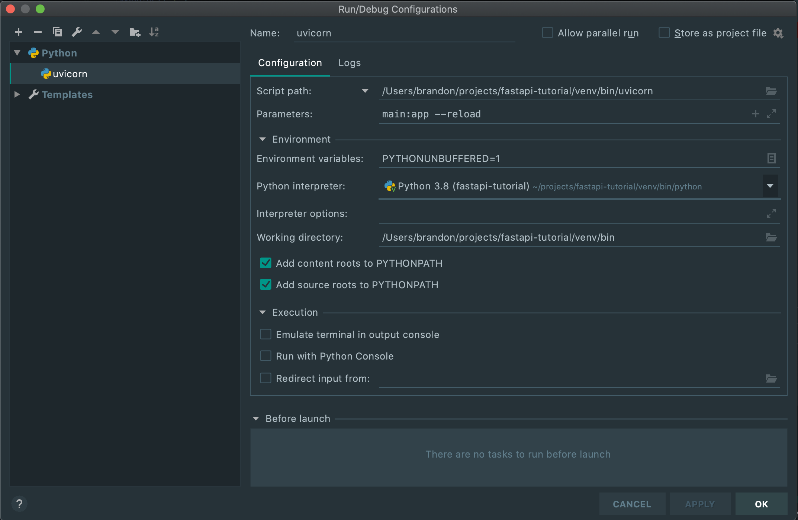

# Tutorial

# Setup

## Setup Folder and Virtual Env

### **Make directory**

```bash
mkdir fastapi-tutorial
```

### **Setup Git**

```bash
git init
```

### **Setup Virtual Env**

```bash
python -m venv venv
```

### Activate Virtual Env

```bash
source venv/bin/activate
```

## Install FastAPI

### Installing FastAPI

```bash
pip install fastapi
```

### Install Gunicron and Uvicorn

```bash
pip install uvicorn

pip install gunicorn
```

### Setup main file

[https://fastapi.tiangolo.com/tutorial/first-steps/](https://fastapi.tiangolo.com/tutorial/first-steps/)

```python
from fastapi import FastAPI

app = FastAPI()

@app.get("/")
async def root():
    return {"message": "Hello World"}
```

### Run uvicorn from terminal

```bash
uvicorn main:app --reload
```

### Run uvicorn PyCharm

- Point script to the uvicorn binary in the virtaul env bin folder
- main:app = file:fastAPI variable
- This allows for debugging as well

